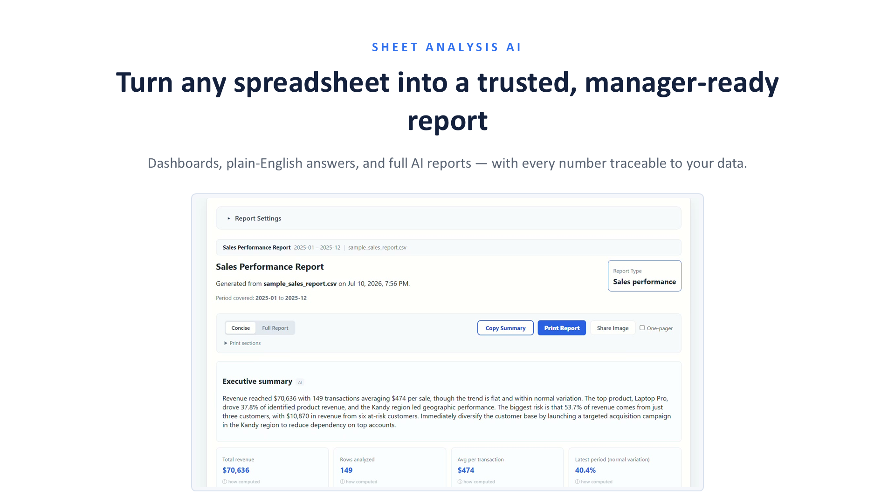
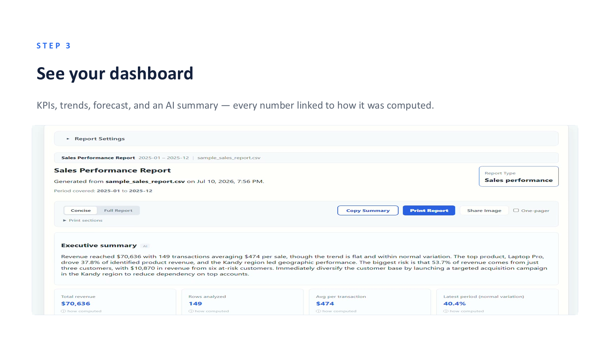
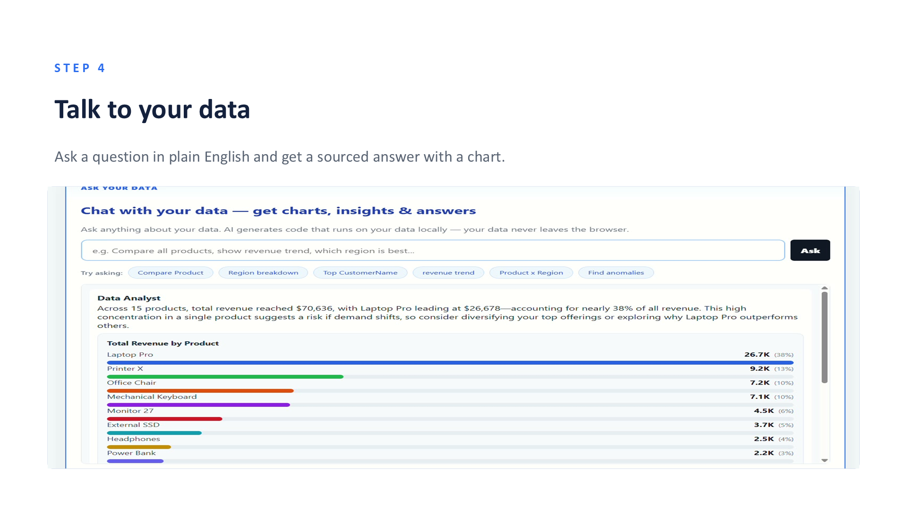
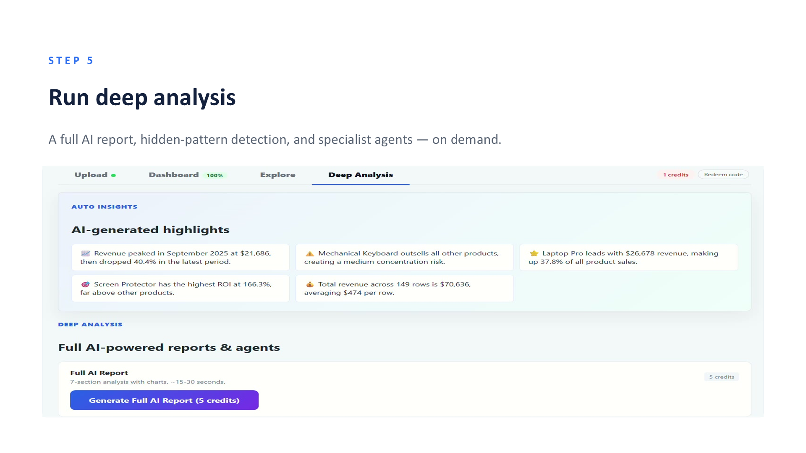
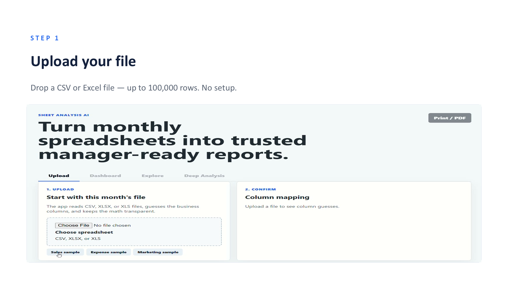

<div align="center">

# 📊 Sheet Analysis AI

### Turn any spreadsheet into a trusted, manager-ready report — where every number traces back to your data.

Upload a CSV or Excel file and get an instant dashboard, plain-English answers, and a full AI report. The difference from other AI tools: **it reconciles every figure to your source data and refuses to show any number it can't verify** — no hallucinated totals.

[](https://react.dev/)
[](https://www.typescriptlang.org/)
[](https://vitejs.dev/)
[](https://www.gnu.org/licenses/agpl-3.0)
[](#-privacy)



</div>

---

## What it does

- **📊 Instant dashboard** — KPIs, trends, a forecast, and a written executive summary, the moment you upload.
- **💬 Talk to your data** — ask a question in plain English ("which region is growing fastest?") and get a sourced answer with a chart.
- **📈 Deep analysis** — a full AI report, hidden-pattern detection, and specialist agents, on demand.
- **✅ Verified numbers** — every figure is reconciled back to your file; anything it can't verify is never shown.
- **⚡ Handles up to 100,000 rows — entirely in your browser.** No server, no upload, no waiting on a backend. All parsing, statistics and charting run client-side on your machine.
- **🔒 Private by design** — your file is parsed and analysed in your browser and is never uploaded to a server.

---

## ✨ Why it's built this way (the interesting part)

Most "AI reads your spreadsheet" tools send a sample of your data to an LLM and let it *estimate* the answer — which means they confidently invent totals and trends you can't check. This project is built specifically so it **can't** do that.

- **A deterministic analysis engine, not an LLM guess.** Parsing, column profiling, KPIs, trends, forecasting and statistics all run as real code in the browser. The numbers come from the data, not from a language model's approximation.
- **A reconciliation gate.** Before any figure is displayed, it is checked against the underlying rows. If a number can't be traced back to the data, it isn't rendered.
- **Real statistical methods**, not vibes — Mann-Kendall trend tests, chi-square concentration, ANOVA seasonality, Pareto/ABC tiering, and RFM segmentation.
- **The AI writes code, it doesn't invent answers.** For "talk to data," the model generates a small piece of analysis code from your column names and a few sample rows; that code then runs locally on your full dataset. The model never sees, and never fabricates, your numbers.
- **It discloses its own limits** — which rows it had to drop, and how confident it is.

The result is analysis you can actually put in front of a decision-maker — the one thing general-purpose LLMs are bad at.

---

## 🖼️ Screenshots

| Dashboard | Talk to Data |
|---|---|
|  |  |

| Deep Analysis | Upload & column detection |
|---|---|
|  |  |

---

## 🧠 How it works

```
CSV / Excel file
      │  (parsed in your browser — never uploaded)
      ▼
Column profiling  →  auto-detect date / revenue / product / customer …
      │
      ▼
Deterministic engine  →  KPIs · trends · forecast · Pareto · RFM · stats
      │
      ├─► Reconciliation gate  →  drop any number that can't be traced to the data
      │
      └─► Optional AI layer (bring-your-own-key)
             • plain-English Q&A (model writes code, code runs locally)
             • AI executive summary & recommendations
             • full AI report + specialist agents
```

The whole **deterministic backbone** (parsing, mapping, dashboard, statistics) works with **no AI key at all**. Adding a key only lights up the optional AI layer — and those requests go straight from your browser to your chosen provider.

---

## 🛠️ Tech stack

- **React 19** + **TypeScript** + **Vite**
- Client-side spreadsheet parsing (CSV + XLSX)
- A custom deterministic analytics/statistics engine (no server round-trips for the core analysis)
- Bring-your-own-key AI layer (OpenAI, Google Gemini, DeepSeek, Groq, OpenRouter, Mistral)

---

## 🚀 Getting started

```bash
# 1. Clone
git clone https://github.com/Durlabhkumarjha/sheet-analysis-ai.git
cd sheet-analysis-ai

# 2. Install
npm install

# 3. Run
npm run dev
```

Open the printed URL (usually `http://localhost:5173`).

- Click **Sales sample** (or upload your own CSV/Excel) → the dashboard, charts and statistics work **immediately, no key required.**
- To enable the AI features, open the **"Connect your AI key"** section in the app and paste an API key from any supported provider.

> This open-source build has **no backend**. It runs fully bring-your-own-key: AI requests go from your browser directly to your provider. Nothing is billed to anyone else.

---

## 🔒 Privacy

Your spreadsheet is read and analysed **entirely in your browser** — it is never uploaded to a server. If you use the optional AI features, only a small slice of context (column names, types, and a few sample rows) is sent to *your own* AI provider to generate a response. Your full file never leaves your device.

---

## 📄 License

Licensed under the **GNU Affero General Public License v3.0 (AGPL-3.0)** — free to use, study, modify, and self-host. If you run a modified version as a network service, you must make your source available under the same license.

**Copyright © 2026 Durlabh Jha**

---

<div align="center">

Built by **[Durlabh Jha](https://github.com/Durlabhkumarjha)**

If this project is useful or interesting, a ⭐ is appreciated.

</div>
